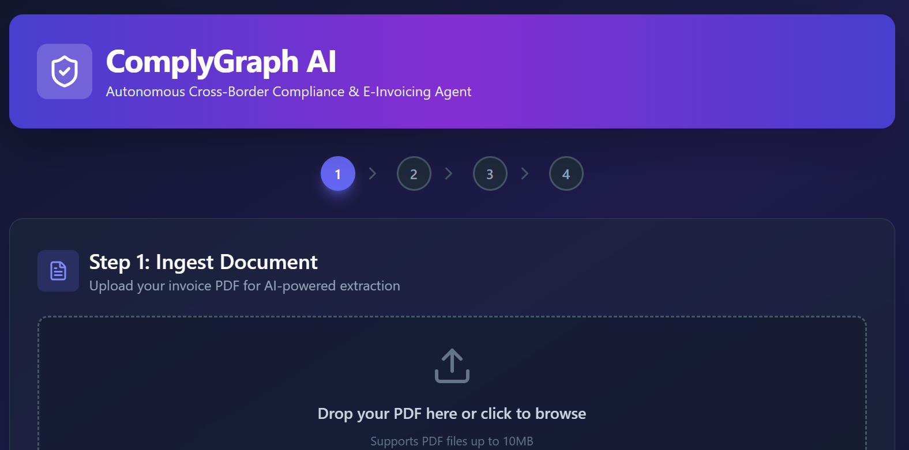
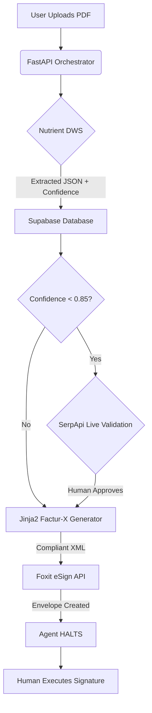

#  ComplyGraph AI
**Autonomous Cross-Border Compliance & E-Invoicing Agent**

ComplyGraph AI is an agentic pipeline that transforms messy supplier invoices into jurisdiction-compliant e-invoices (Factur-X/ZUGFeRD) and securely hands them off for human signature. Built to solve the upcoming 2026 EU e-invoicing mandates, it combines intelligent document extraction, live regulatory validation, and secure human-in-the-loop (HITL) handoffs.



---

## Key Features

1. **Intelligent Ingestion (Milestone 1):** Uses Nutrient DWS to extract structured data from messy PDFs, complete with confidence scoring.
2. **Live Regulatory Validation (Milestone 2):** Automatically detects low-confidence fields (like VAT IDs) and triggers SerpApi to cross-reference live web registries.
3. **Jurisdiction Branching Logic (Milestone 3):** Uses Jinja2 to dynamically generate Factur-X compliant XML payloads, applying specific tax rules (e.g., 20% VAT for France, 19% for Germany).
4. **Secure Agentic Handoff (Milestone 4):** Prepares the document via Foxit eSign API but **intentionally halts** execution, returning control to the human for the legally binding signature to maintain non-repudiation.

---

## Project Structure

Here is the complete project structure for your **ComplyGraph AI** application, organized by the backend and frontend we built.

```text
comply-graph/                    # Root Directory
│
├── .env                         # CRITICAL: Make sure this is in .gitignore!
├── .env.example                 # Safe template for judges to copy
├── .gitignore                   # Root gitignore
├── .python-version              # Python version lock
├── LICENSE                      # MIT License
├── main.py                      # FastAPI Backend (Orchestrator & Supabase logic)
├── pyproject.toml               # Python dependencies (uv)
├── README.md                    # Main project README for judges
├── requirements.txt             # Fallback Python dependencies
├── uv.lock                      # Lockfile for uv
│
├── sample-docs/                 # Test files for the demo
│   └── messy_supplier_invoice.pdf
│
├── comply-graph-ui/             # Next.js Frontend
│   ├── .gitignore
│   ├── AGENTS.md                # (AI assistant config)
│   ├── CLAUDE.md                # (AI assistant config)
│   ├── eslint.config.mjs
│   ├── next-env.d.ts
│   ├── next.config.ts
│   ├── package-lock.json
│   ├── package.json
│   ├── postcss.config.js
│   ├── postcss.config.mjs
│   ├── README.md                # (Frontend specific readme, optional)
│   ├── tailwind.config.js
│   ├── tsconfig.json
│   │
│   ├── pictures/                # Screenshots for your README
│   │   └── comply_graph_dashboard.png
│   │
│   ├── public/                  # Static assets
│   │
│   └── src/
│       └── app/
│           ├── globals.css      # Tailwind directives
│           ├── layout.tsx       # Root layout & metadata
│           └── page.tsx         # Main Dashboard UI
│
└── pictures/                    # Pictures of the UI in action
    ├── ComplyGraphDashboard-1.png
    ├── ComplyGraphDashboard-2.png      
    ├── ComplyGraphDashboard-3.png
    └── ComplyGraphDashboard-4.png
```

---

## System Architecture



---

## ️Tech Stack

- **Backend Orchestration:** Python, FastAPI, httpx
- **Frontend UI:** Next.js 14, React, Tailwind CSS, Lucide Icons
- **Database & State:** Supabase (PostgreSQL)
- **Document AI:** Nutrient DWS (Extraction API)
- **Live Web Search:** SerpApi (Google Search API)
- **Template Engine:** Jinja2 (Factur-X Branching Logic)
- **eSignature:** Foxit eSign API

---

## Sponsor Challenge Alignment

| Sponsor | Challenge Requirement | How ComplyGraph Solves It |
| :--- | :--- | :--- |
| **Nutrient** | Intelligent Document Processing | Extracts messy PDFs into structured JSON with granular confidence scores. |
| **SerpApi** | Live Data Enrichment | Validates low-confidence VAT IDs against live EU web registries. |
| **Foxit** | Secure Agent Handoff | Agent prepares the envelope via API but **halts before signing**, preserving human legal agency. |

---

## Quick Start Guide

### 1. Prerequisites
- Python 3.10+ and `uv`
- Node.js 18+ and `npm`
- A Supabase project
- API Keys for Nutrient, SerpApi, and Foxit

### 2. Backend Setup (FastAPI)
```bash
# Clone the repository
git clone https://github.com/your-username/comply-graph.git
cd comply-graph

# Create and activate virtual environment
uv init --no-readme --vcs none
cd comply-graph

# Install dependencies
uv add fastapi uvicorn httpx python-dotenv python-multipart jinja2 supabase

# Configure environment variables
cp .env.example .env
# Edit .env and add your API keys (DWS_EXTRACTION_API_KEY, SERPAPI_API_KEY, SUPABASE_URL, SUPABASE_KEY, FOXIT_CLIENT_ID, FOXIT_CLIENT_SECRET, FOXIT_GENERATE_URL)

# Run the backend server
uvicorn main:app --reload --port 8000
```

### 3. Frontend Setup (Next.js)
```bash
# Create a new Next.js app with TypeScript and Tailwind CSS
npx create-next-app@latest comply-graph-ui --typescript --tailwind --eslint --app --src-dir --no-import-alias

# Change directory
cd comply-graph-ui

# Install Lucide React and tailwindcss
npm install lucide-react
npm install -D tailwindcss@3.4.1 postcss autoprefixer # version is more stable now

# Install dependencies
npm install

# Run the development server
npm run dev
```
Open [http://localhost:3000](http://localhost:3000) to see the dashboard.

---

##  API Documentation

The backend exposes 4 core endpoints at `http://localhost:8000`:

### 1. Ingest & Extract
```bash
curl -X POST 'http://127.0.0.1:8000/api/v1/ingest-and-extract' \
  -F 'file=@sample-docs/messy_supplier_invoice.pdf'
```
*Returns extracted JSON, confidence scores, and a `job_id`.*

### 2. Validate VAT (HITL)
```bash
curl -X POST 'http://127.0.0.1:8000/api/v1/validate-vat' \
  -H 'Content-Type: application/json' \
  -d '{"vat_id": "", "supplier_name": "CONTOSO LTD.", "country_code": "US"}'
```
*Returns live search results from SerpApi.*

### 3. Generate Compliant Document
```bash
curl -X POST 'http://127.0.0.1:8000/api/v1/generate-compliant-document' \
  -H 'Content-Type: application/json' \
  -d '{"extracted_data": {...}, "jurisdiction": "FR", "approved_by_human": true}'
```
*Returns a Factur-X compliant XML payload.*

### 4. Foxit Secure Handoff
```bash
curl -X POST 'http://127.0.0.1:8000/api/v1/foxit-prepare-and-handoff' \
  -H 'Content-Type: application/json' \
  -d '{"job_id": 1, "document_id": "doc_1", "compliant_xml_payload": "...", "signer_email": "user@test.com", "human_approved_for_signing": true}'
```
*Creates the Foxit envelope and returns the signing URL. **The agent halts here.***

---

## Demo Video

[](https://www.youtube.com/watch?v=YOUR_VIDEO_ID)

---

##  License
MIT License. Built for the 2026 API & Cloud AI Hackathon.
